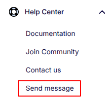
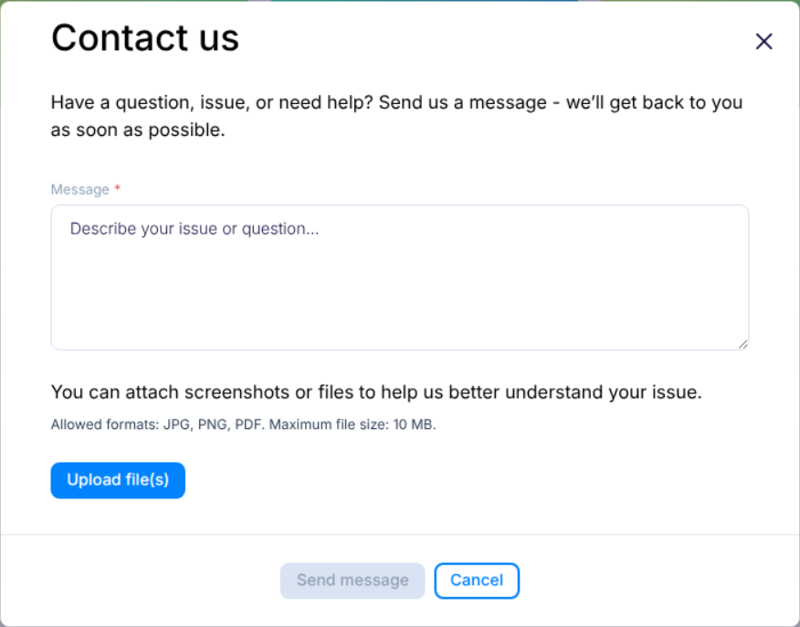

---
tags:
  - Content Creator
---

title: Report an issue
description: Step-by-step guide for reporting issues from the Flotiq Panel

# Report an issue

Use this form when something in the Flotiq Panel is not working as expected.
Your message goes directly to Support.

## Open the issue form

1. In the Panel, go to `Help Center -> Send message`.
2. The report issue window opens.

{: .border .center}

## Fill in the form

Add the details below:

- `Message` - explain:
    - what happened,
    - what you expected to happen,
    - how to repeat the issue (step by step).
- `Attachment` (optional) - add files (PDF, PNG, or JPG), up to 10 MB.

{: .border .width75 .center}

For faster help, include names of pages, content types, or objects related to the issue.

## What happens after submission

- Your report is sent to Support by email.
- You get a status message in the Panel:
    - `accepted` when the report is submitted,
    - `error` when submission fails.

If you see `error`, try again and include the same details.

## Data added automatically

To help Support investigate faster, the system adds technical context automatically:

- user and organization identifiers,
- browser and operating system information,
- timestamp (date and time of submission).

## Example information sent in the support email

### Sender Information

Example values are shown below.

| Field              | Value                                      |
|--------------------|--------------------------------------------|
| Ticket Identifier  | `xdd9245475c90d93f0b39fce738ae1efd984ce0x` |
| User ID            | `xxxxxxxx-xxxx-xxxx-xxxx-xxxxxxxxxxxx`     |
| Space ID           | `xxxxxxxx-xxxx-xxxx-xxxx-xxxxxxxxxxxx`     |
| Organization ID    | `xxxxxxxx-xxxx-xxxx-xxxx-xxxxxxxxxxxx`     |
| Issue created date | `2026-06-14 20:08:33`                      |

### Metadata

```json
{"userAgent":"Mozilla/5.0 (Macintosh; Intel Mac OS X 10_15_7) AppleWebKit/537.36 (KHTML, like Gecko) Chrome/149.0.0.0 Safari/537.36","platform":"macOS","screen":{"width":1710,"height":1107,"viewportWidth":1710,"viewportHeight":888,"pixelRatio":2},"locale":"en-US"}
```
{ data-search-exclude }
