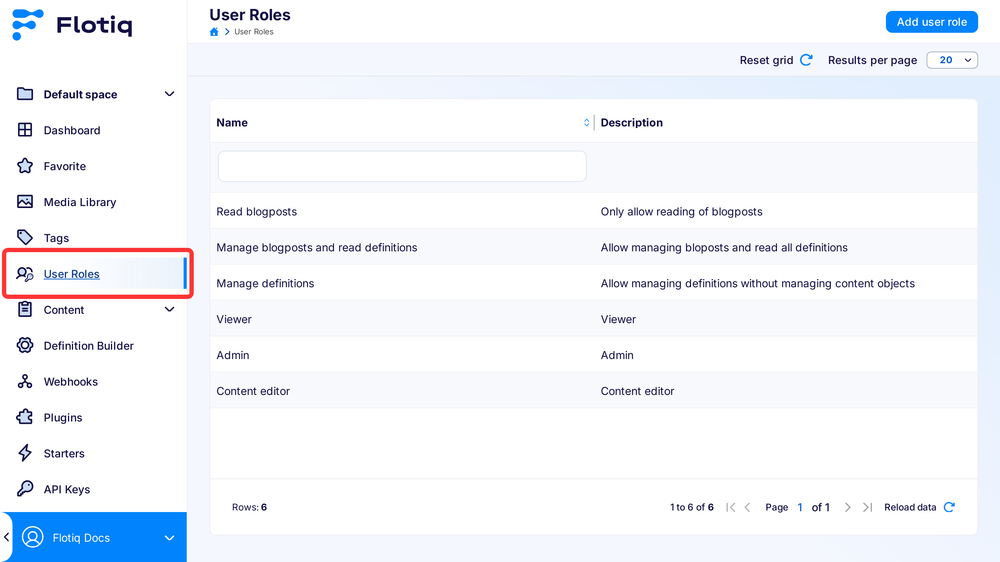
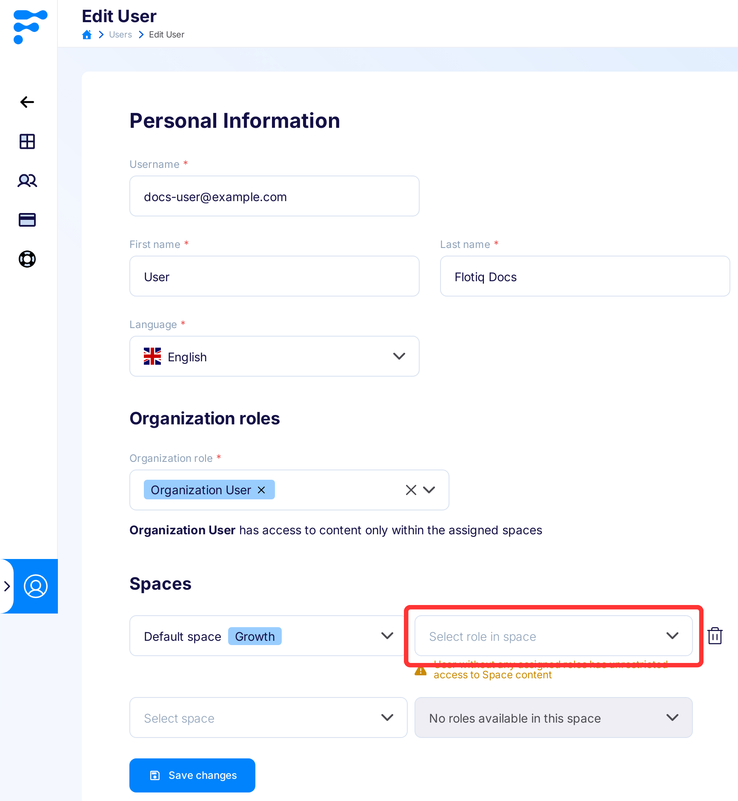
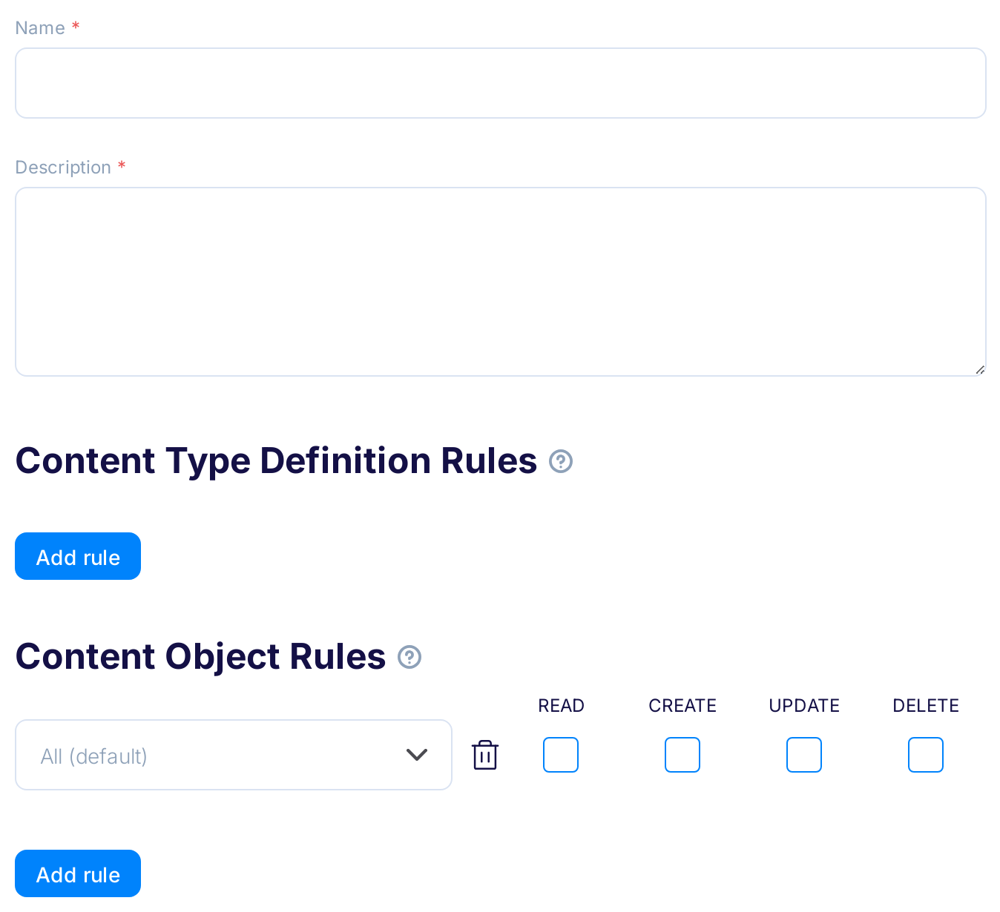
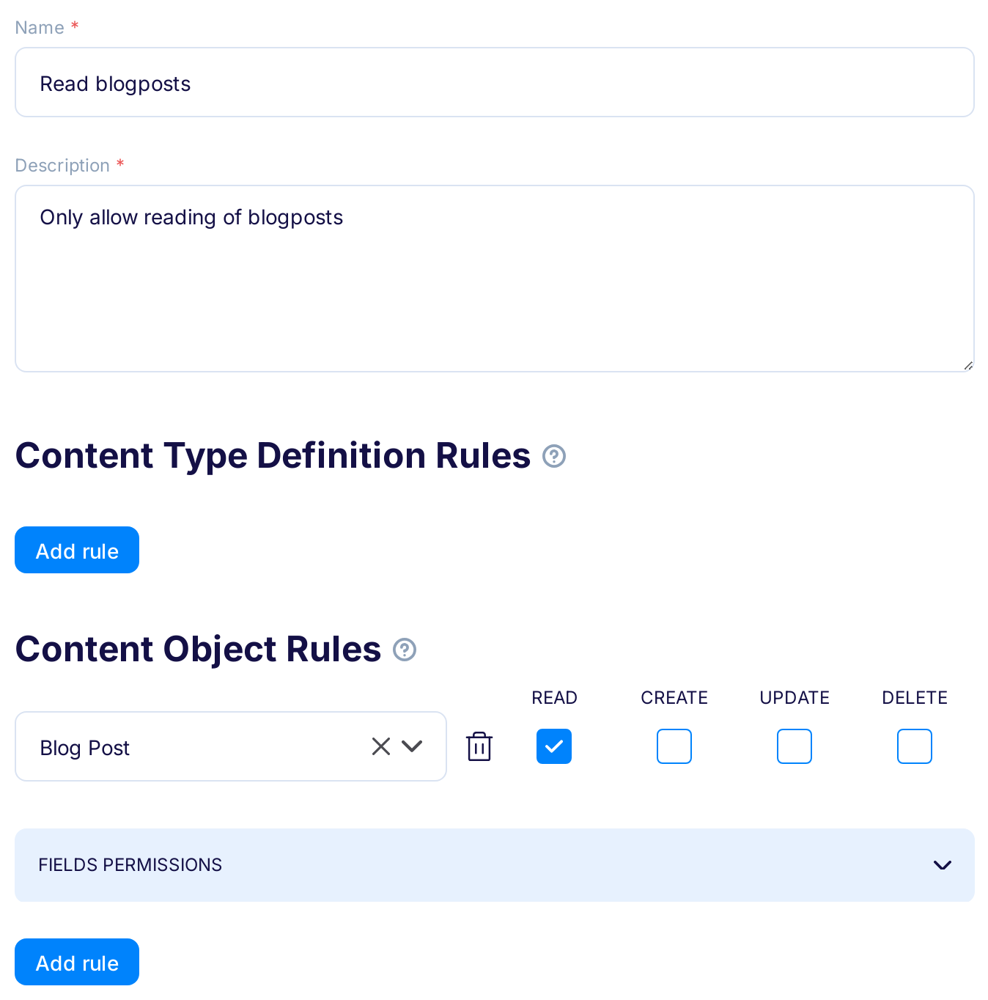
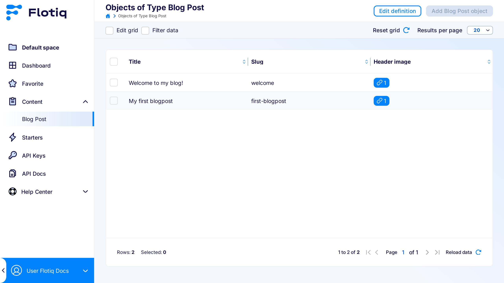
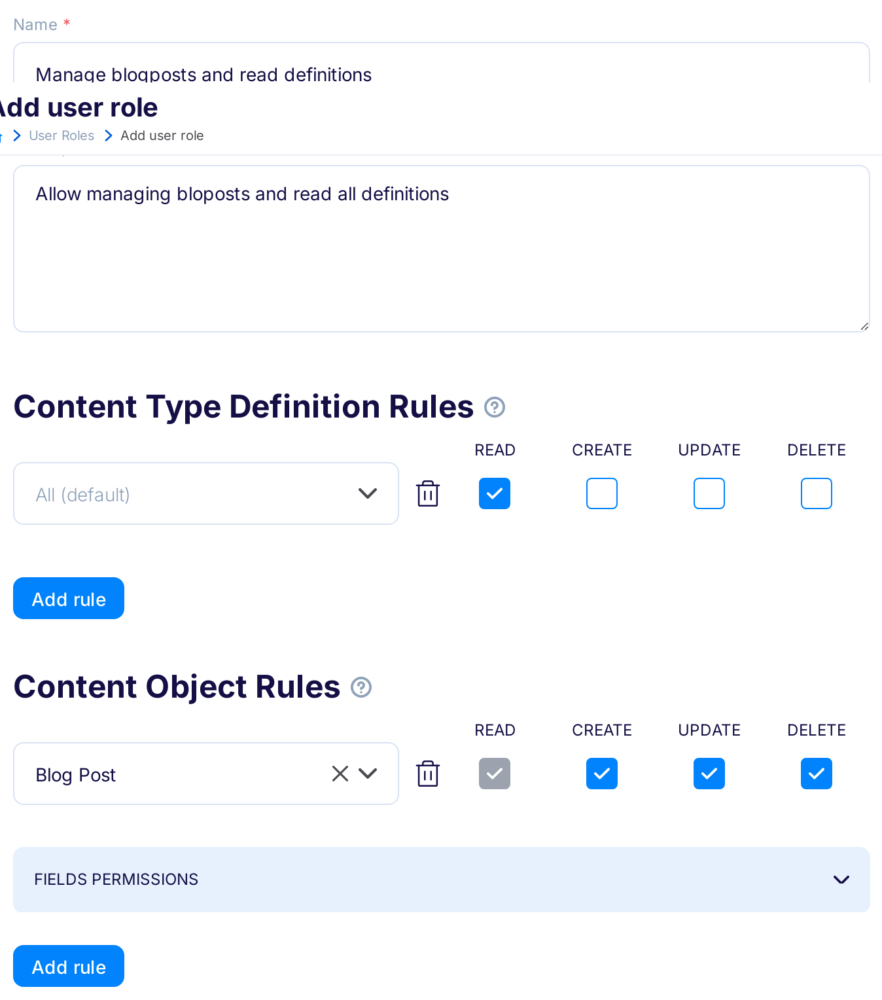
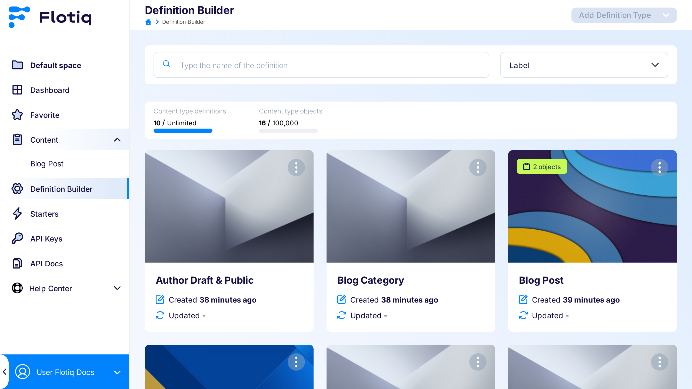
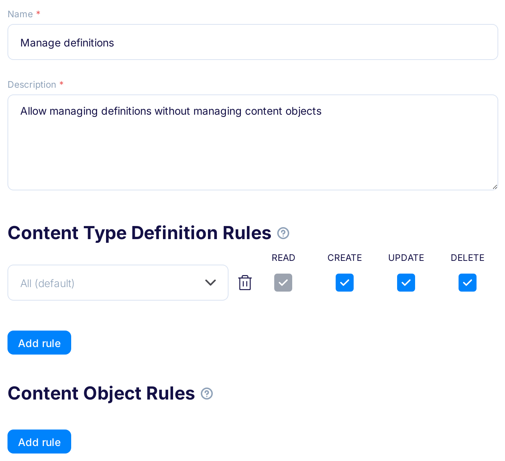
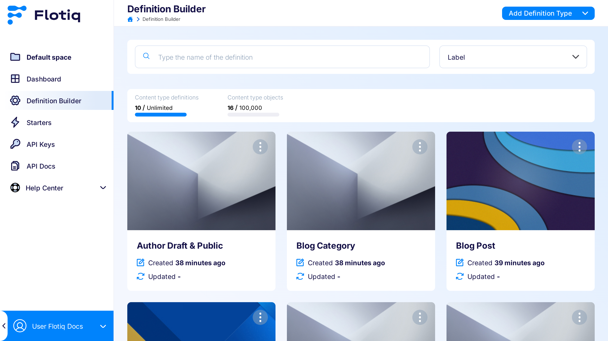

title: User Roles
description: How to manage User Roles in Flotiq.

# User Roles

!!! note
    Predefined user roles are available starting from the Basic plan and above.
    Custom Flotiq user roles can be customized in the Growth plan and above.

## What is a User Role?

A user role represents a specific set of actions assigned to a group of users. By assigning user roles, you can control the actions each user can perform in the system.
The actions that can you determine are:

1. Read: Permits users to view existing content without making changes.
2. Create: Allows users to add new content.
3. Update: Grants permission for users to make changes to existing content.
4. Delete: Provides authority for removing content.

User role allows you to restrict the actions for specific Content Type Definition or Content Type Objects.

!!! note
    Managing user roles is available only for `Organization Admin`. It’s important to note that a user without any assigned role has unrestricted access to all resources.

## Predefined User Roles

In Flotiq, predefined user roles streamline the management of user permissions, ensuring that users can perform only the actions their roles permit. These roles cover typical organizational needs.

!!! warning
    Users without any assigned role have unrestricted access.

!!! note
    Predefined roles can be modified in the Growth plan and above

### Available Predefined Roles

#### **Admin**

- **Description**: Full access to all resources.
- **Permissions**:
    - **CO**: Read, create, update, delete.
    - **CTD**: Read, create, update, delete.

#### **Content Editor**

- **Description**: Manages and edits content.
- **Permissions**:
    - **CO**: Read, create, update, delete.
    - **CTD**: Read.

#### **Viewer**

- **Description**: Limited to viewing content.
- **Permissions**:
    - **CO**: Read.
    - **CTD**: Read.

These predefined roles help control user actions and maintain system security. For custom permissions, please contact our support team.

## List User Roles

To manage user roles, navigate to the dedicated **User Roles** section within the application. In this section, you have the ability to customize grid column widths and set the results per page limit.

{: .border}

## Assign User Role

1. Navigate to the `Users` tab in the Organization management view.
2. Find a user and edit their details.
3. In the right sidebar, you’ll find a dropdown with existing user roles within a single space. If you have multiple spaces, you’ll see several forms with roles. If a space doesn’t have any roles added, the form won’t be visible.

{: .border}

## Custom User Roles

!!! note
    Custom Flotiq user roles are available starting from the Growth plan and above.

### Add User Role

You can create new user roles by clicking the **Add User Role** button or duplicate existing ones in the list view.

1. **Role Creation**: To add a new user role, complete the form by providing a name, description, and at least one rule. These rules determine the permissions associated with the role.
2. **Assigning Actions**: You can assign various actions to different Content Types. If you need additional rules, click **Add Rule**. To remove a rule, simply click the trash icon.
3. **Rule Types**:
    * `CO`: These rules apply to specific Content Objects of a certain Type. However, for managing the type definition itself, add a separate rule with the `CTD` type.
    * `CTD`: These rules apply to Content Type Definitions.

{: .center .width75 .border}

!!! note 
    An essential point to note is that every Content Type has read access to its definition via the API. However, these definitions remain hidden in the dashboard until you explicitly add a rule granting read access for a specific definition.

### Examples

!!! hint
    In the examples, the media, webhook, and plugin pages are not visible in the menu. They require additional permissions for managing.

#### Read Blogposts

Users have read access to Content Objects of Type Blogposts. However, they won’t be able to view the definition of Blogposts in the **Definition Builder** section.

{: .center .width75 .border}

Outcome for the user with the assigned role:

{: .border}

#### Manage Blogposts and read Content Type Definitions

We grant users permission to perform any action with Content Objects of type Blogposts and allow them to read any Content Type Definitions in the Dashboard.

{: .center .width75 .border}

Outcome for the user with the assigned role:

{: .border}

#### Manage Content Type Definitions

We grant users permission to perform any action with any Content Type Definitions, but disallow them from interacting with their Content Objects.

{: .center .width75 .border}

Outcome for the user with the assigned role:

{: .border}
