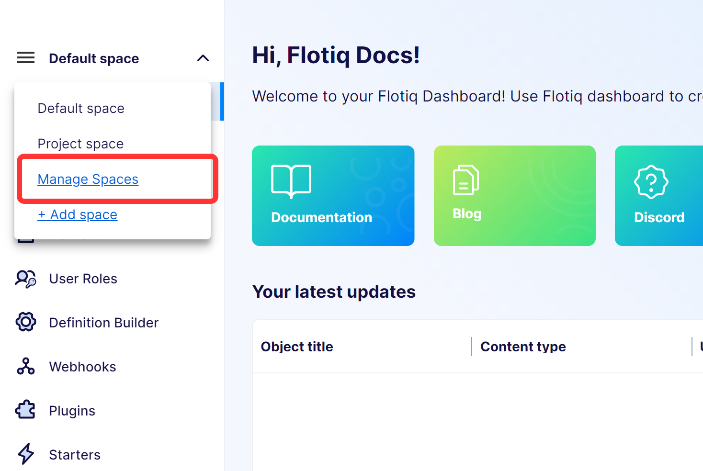
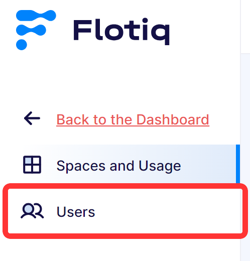
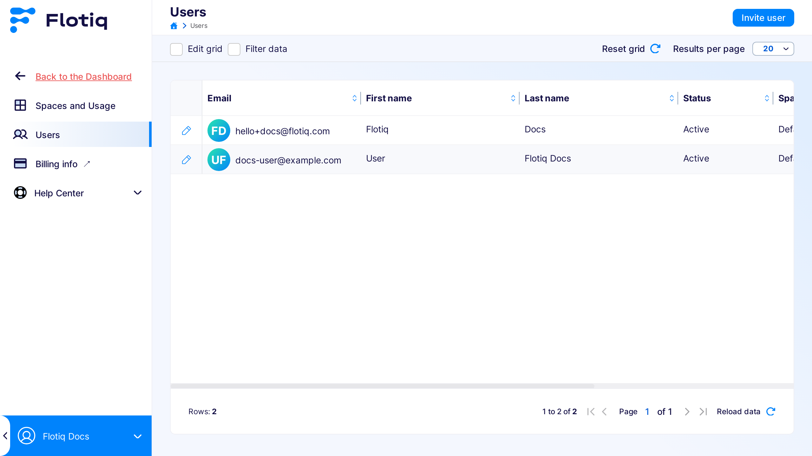
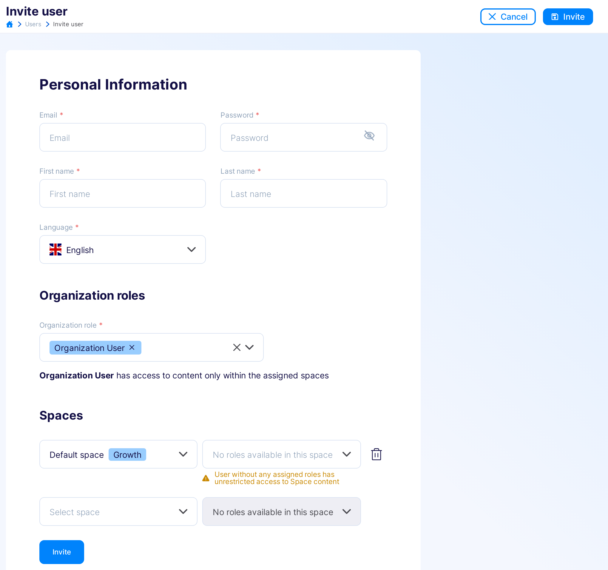

---
tags:
  - Administrator
---

title: Users
description: How to manage users in Flotiq.

This page explains how to manage **Users**, including your own settings, using the [Flotiq Dashboard](https://editor.flotiq.com){:target="_blank"}. 

!!! hint
    Only `Organization Admin` can manage users in an Organization. In API and internal role names, this role is represented as `ROLE_HEADLESS_ADMIN` (legacy wording: `headless admin`). If you do not have this role, you will not see the `Users` tab.

## Who can manage users

- **Organization Admin** can invite, edit, and delete users in the Organization.
- **Content Editor** is a Space role. It can manage content in assigned Spaces but cannot manage Organization users, Spaces, or billing.

To manage users, navigate to `Manage Spaces` or `Organization Settings`.

{: .center .width75 .border}

## Listing users

Click `Users` in the menu on the left to get to users list:

{: .center .width75 .border}

If you don't have any new user added, you will see only your own user on the list.

{: .center .border}

## Adding new User :fontawesome-solid-triangle-exclamation:{ .pricing-info title="Limits apply" }[^1]

You can invite more team members to your Flotiq project by clicking the `Invite User` button in the Users tab, which opens user editor.

{: .center .border}

When adding new user you have to define its: Email and Name. After saving, an invitation email will be sent to the provided address.

{:.width50 .center .border}

Once the new user accepts the invitation, they will be prompted to set a password, completing the onboarding process.

{: .center .border}

## Editing users

When browsing users list in `Users` tab from the left panel, you can make changes to your user by clicking the pencil icon, which will open the `Edit User` tab.

{: .center .width75 .border}

Here you can change your settings, like your name and password, but also edit your email subscription preferences, or the user.

## Deleting users

Users can be permanently deleted from the project only by an `Organization Admin` user (sometimes labeled `headless admin`).

!!! warning
    Deleting a user is permanent and cannot be undone.

### What happens after deleting a user

- Content created by the deleted user is not removed.
- Existing Content Objects stay in place and remain available according to their current status and permissions.
- Version History entries are preserved. Changes made by a deleted user are still visible in the history as edits made by a deleted account.
- Personal data of the deleted user is anonymized in the database.

## Related docs

- [Panel overview](./index.md)
- [API access & scoped keys](../API/index.md)
- [Content Objects](../API/content-objects.md)
- [Webhooks overview](./webhooks/index.md)

[^1]: Number of available Team Members depends on the chosen subscription plan. Check pricing and limits [here](https://flotiq.com/pricing){:target="_blank"}
