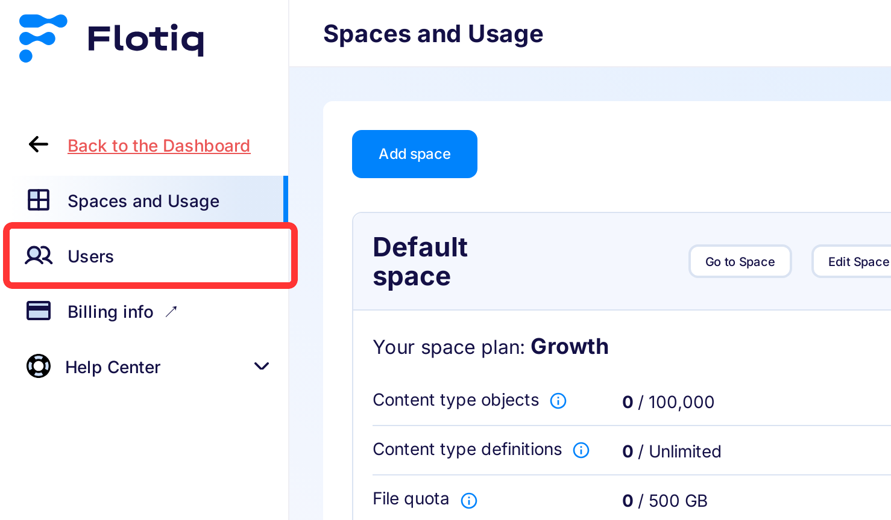
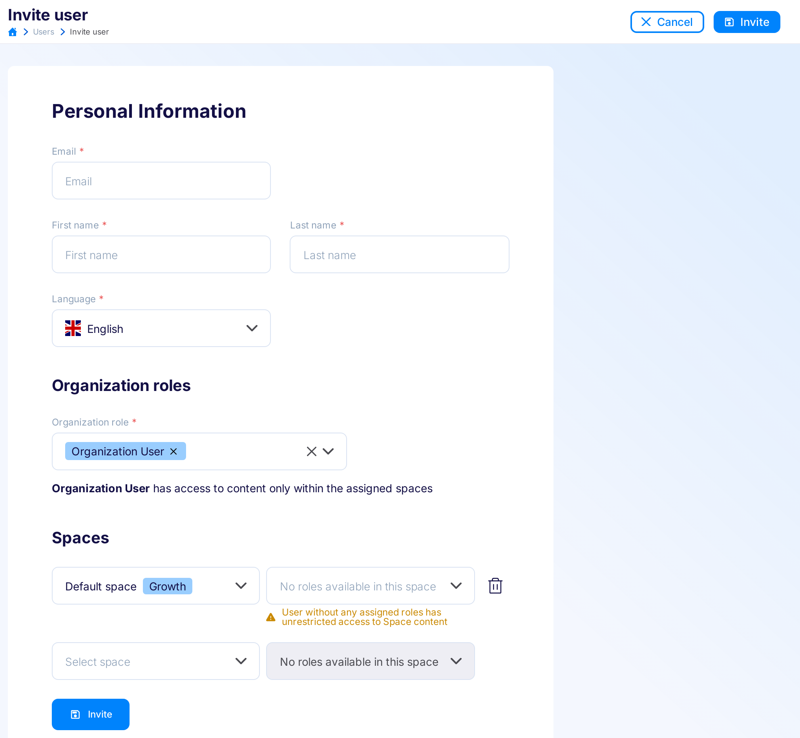
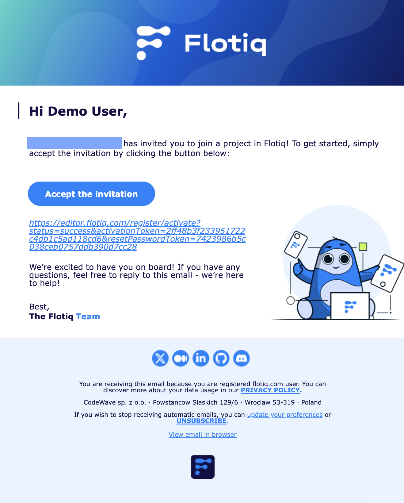
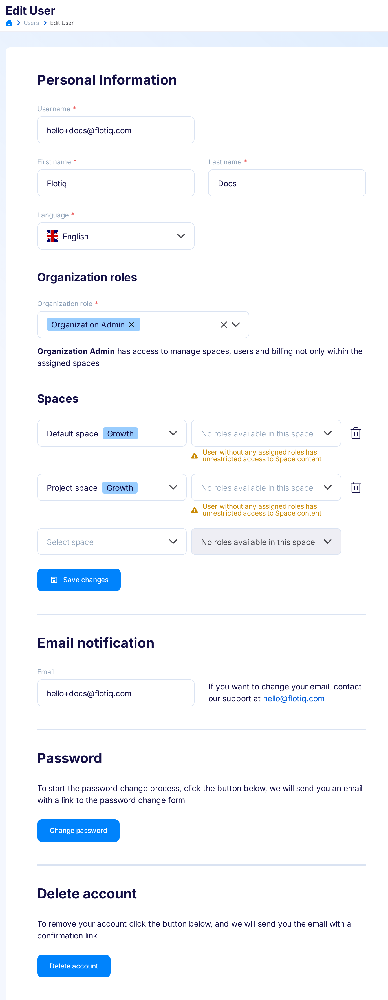

title: Users
description: How to manage users in Flotiq.

This page describes how to manage **Users**, including your own settings, using [Flotiq Dashboard](https://editor.flotiq.com){:target="_blank"}. 

!!! hint 
    Only a user Role headless admin can manage other users in Flotiq project. If you do not have the required role, you will not be able too see the `Users` tab.

## Adding new User :fontawesome-solid-triangle-exclamation:{ .pricing-info title="Limits apply" }[^1]

Click `Users` in the menu on the left to get to users list:

{: .center .border}

If you don't have any new user added, you will see only your own user on the list. 

{: .center .border}

You can add more team members to your Flotiq project by clicking the `Add User` button, which opens an user editor.

{: .center .border}

When adding new user you have define its: Email, Name, and Password. After saving, there will be registration veryfication email sent to the email you entered.

{: .center .border}

Once new user verifies his email, he will be asked to enter a new password and the process of adding a new team member will be completed.

## Changing your user settings & preferences.

When browsing users list in `Users` tab from the left panel, you can make changes to your user by clicking the pencil icon, which will open the `Edit User` tab. 

{: .center .border}

Here you can change your settings, like your name and password, but also edit your email subscription preferences, or delete your flotiq account.

<!---->
[^1]: Number of available Team Members depends on the chosen subscription plan. Check pricing and limits [here](https://flotiq.com/pricing){:target="_blank"}
