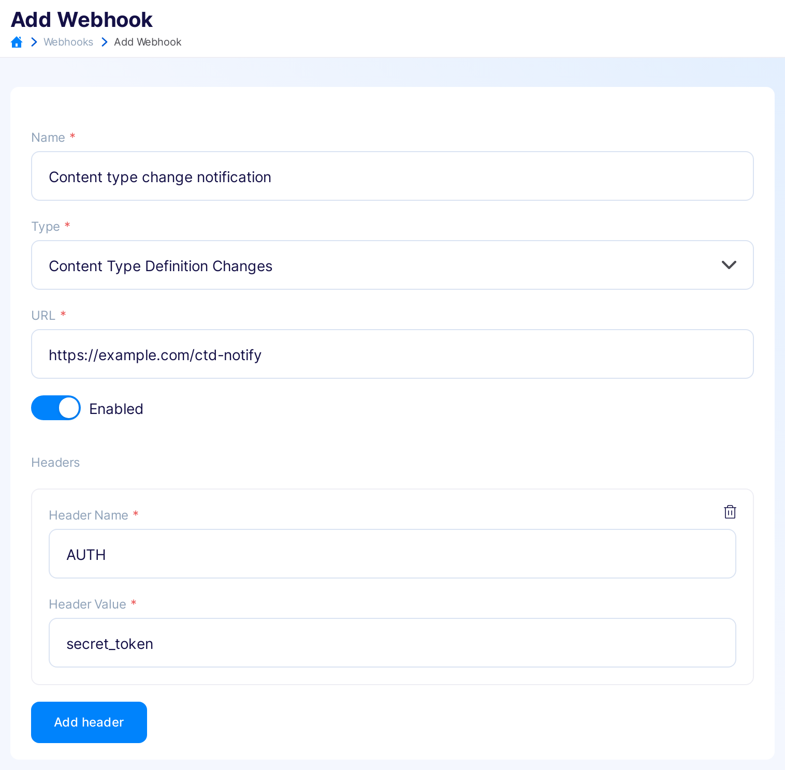

---
tags:
  - Developer
---

title: Async CTD webhooks
description: Async Content Definition webhooks in Flotiq

# Content Definition webhooks

## What is a Content Definition webhook?

`Content Definition Changes` webhook type is very similar to `Async Content Object Changes`, but with minor differences. First of all that kid of webhook is executed on each action (`Create`, `Update`, `Delete`), preformed on yours `Content Definition's`.

## Creating a Content Definition changes webhook

To create your new `Content Type Definitions` Webhook, click on the main menu `Webhooks` -> `Add new Webhook`. Then select `Type` as `Content Type Definition Changes`

{: .border .width75 .center}

!!! Note
    `Action` input will disappear, because `Content Definition Changes` webhooks are fired on every `Content Definition's` action  (`Create`, `Update`, `Delete`).

!!! Note
    `Content Type Definitions` input will disappear as well, since `Content Definition Changes` webhooks are listening on actions performed on any of yours `Content Definition's`.

## Content Definition Changes webhooks payload
When a `Content Definition Changes` Webhook is executed, a payload containing information about the webhook, the action name (`Create`, `Update`, `Delete`) and the `Content Definition's` data is sent to the target URL.

!!! Note
    `Content Definition Changes` Webhooks are fired asynchronously

```json
{
  "webhookId": "1a78f67f-dc99-413b-bc2e-6e36664f4411",
  "action": "Create",
  "contentTypeName": "product",
  "ref": "/api/v1/internal/contenttype/product",
  "payload": {
    "id": "5c40813e-afbb-11ee-95b8-1275d669877f",
    "name": "product",
    "label": "Product",
    "workflowId": "generic",
    "internal": false,
    "schemaDefinition": {
      "type": "object",
      "allOf": [
        {
          "$ref": "#/components/schemas/AbstractContentTypeSchemaDefinition"
        },
        {
          "type": "object",
          "properties": {
            "name": {
              "type": "string",
              "minLength": 1
            },
            "slug": {
              "type": "string",
              "pattern": "^[a-zA-Z0-9-_]*$",
              "minLength": 1
            },
            "price": {
              "type": "number",
              "minLength": 1
            },
            "description": {
              "type": "string"
            },
            "productImage": {
              "type": "array",
              "items": {
                "$ref": "#/components/schemas/DataSource"
              },
              "minItems": 0
            },
            "productGallery": {
              "type": "array",
              "items": {
                "$ref": "#/components/schemas/DataSource"
              },
              "minItems": 0
            }
          }
        }
      ],
      "required": [
        "name",
        "slug",
        "price"
      ],
      "additionalProperties": false
    },
    "metaDefinition": {
      "order": [
        "name",
        "slug",
        "price",
        "description",
        "productImage",
        "productGallery"
      ],
      "propertiesConfig": {
        "name": {
          "label": "Name",
          "unique": true,
          "helpText": "",
          "inputType": "text",
          "isTitlePart": true
        },
        "slug": {
          "label": "Slug",
          "unique": true,
          "helpText": "Slug can only have alphanumerical characters, - and _",
          "inputType": "text"
        },
        "price": {
          "label": "Price",
          "unique": false,
          "helpText": "",
          "inputType": "number"
        },
        "description": {
          "label": "Description",
          "unique": false,
          "helpText": "",
          "inputType": "richtext"
        },
        "productImage": {
          "label": "Product image",
          "unique": false,
          "helpText": "",
          "inputType": "datasource",
          "validation": {
            "relationContenttype": "_media"
          }
        },
        "productGallery": {
          "label": "Product gallery",
          "unique": false,
          "helpText": "",
          "inputType": "datasource",
          "validation": {
            "relationMultiple": true,
            "relationContenttype": "_media"
          }
        }
      }
    },
    "deletedAt": null,
    "createdAt": "2024-01-10T13:22:53.000000+0000",
    "updatedAt": null
  }
}
```
{ data-search-exclude }


!!!Note
    When executing the `Delete` action, only the definition's id is sent in the payload:

```json
{
  "webhookId": "00374514-8614-4046-8c59-2d750969b79d",
  "action": "Delete",
  "contentTypeName": "product-5c40813e-afbb-11ee-95b8-1275d669877f",
  "ref": "/api/v1/internal/contenttype/ssuper-a79c0ebf-9f32-11ee-9dc4-dede3a70fda7",
  "payload": {
    "id": "product-5c40813e-afbb-11ee-95b8-1275d669877f"
  }
}
```
{ data-search-exclude }