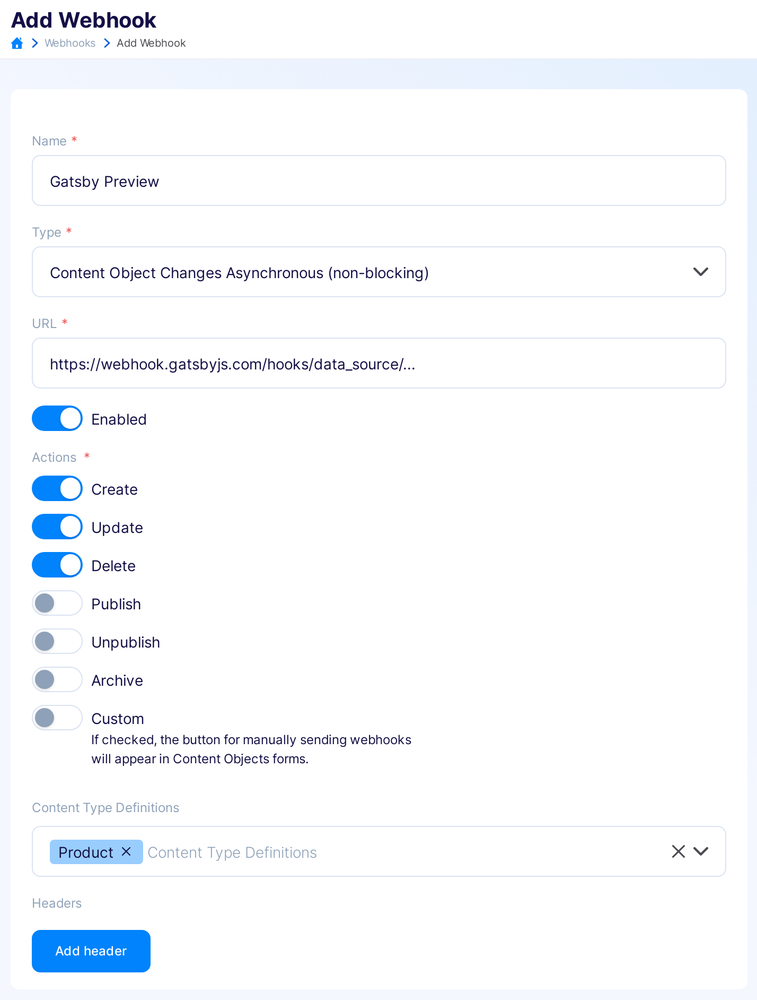
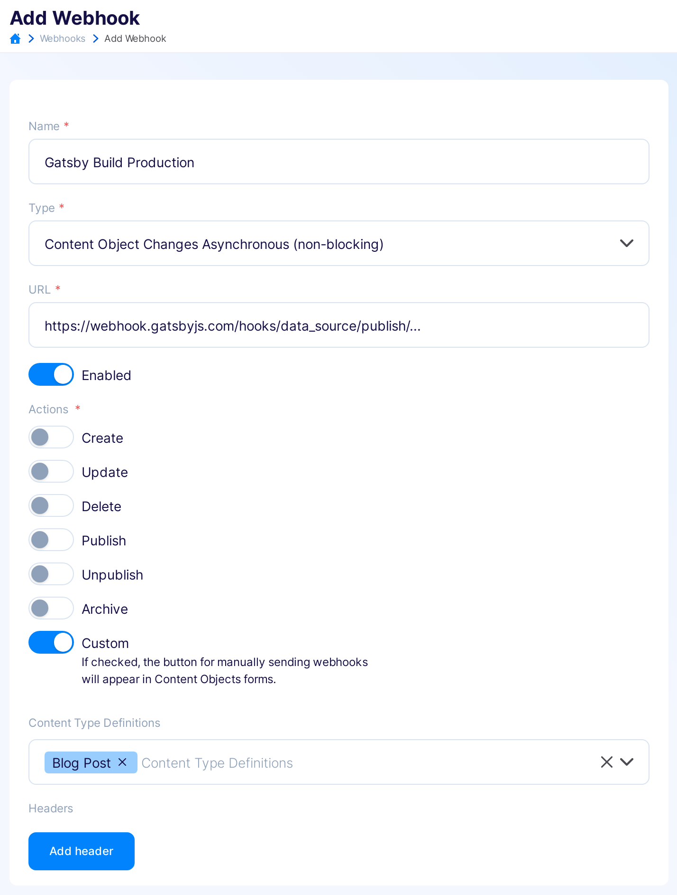
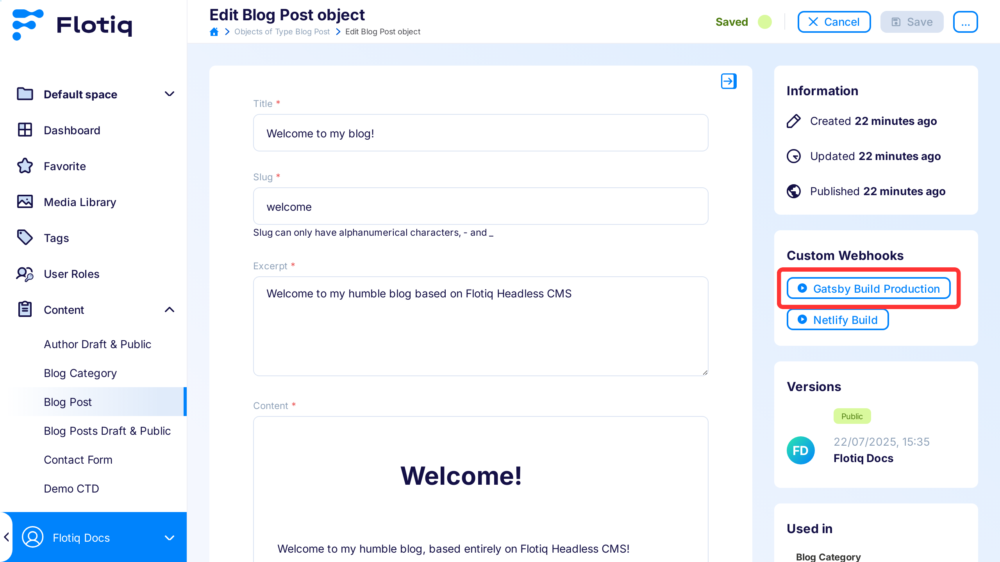
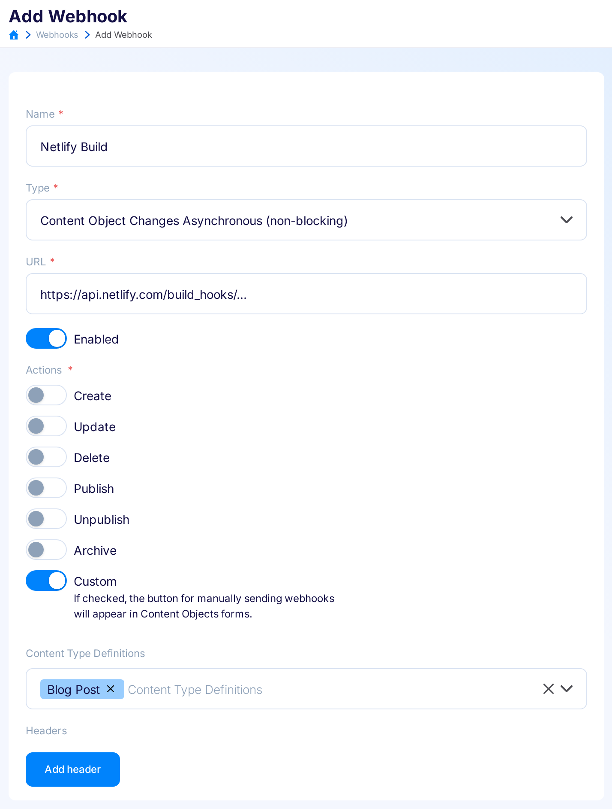
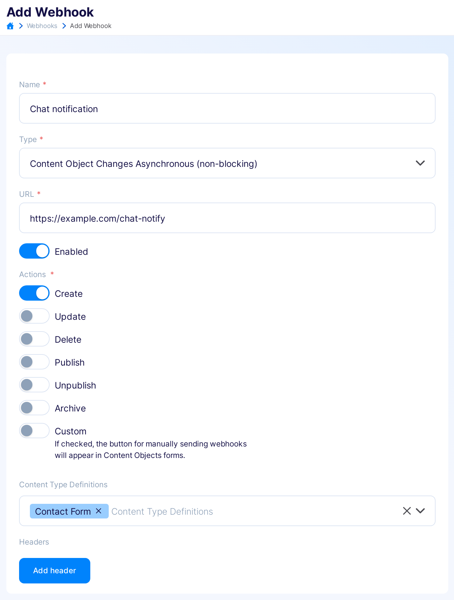
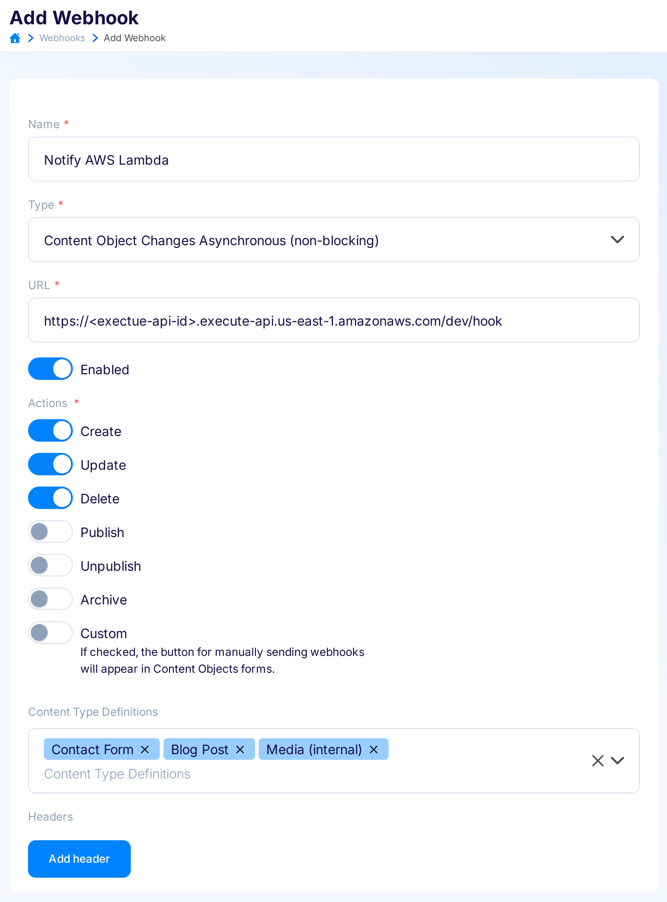

---
tags:
  - Developer
---

title: Webhooks - examples
description: How to use webhooks in Flotiq - examples

# Webhook examples

As we said, webhooks can help with many scenarios.
Check out our examples and use them in your projects or treat them as a signpost for your work:

1. [Trigger a Gatsby preview when site content was changed](#1-trigger-a-gatsby-preview-when-site-content-was-changed).
2. [Trigger a Gatsby production build when a `Build production` button was clicked](#2-trigger-a-gatsby-production-build-when-a-build-production-button-was-clicked).
3. [Trigger a Netlify build when a `Build site` button was clicked](#3-trigger-a-netlify-build-when-a-build-site-button-was-clicked).
4. [Send a RocketChat notification when the contact form was submitted](#4-send-a-rocketchat-notification-when-the-contact-form-was-submitted).
5. [Trigger AWS Lambda serverless function when entry is changed](#5-trigger-aws-lambda-serverless-function-when-entry-is-changed).

!!! Note
    If you are new in webhooks, read the [Flotiq Webhooks introduction](/docs/panel/webhooks/) first.

## 1. Trigger a Gatsby preview when site content was changed

Prerequisites:
We assume, that you have `Product` Content Type Definition in Flotiq.

In the [Gatsby Cloud](https://www.gatsbyjs.com/dashboard) dashboard:

1. Go to your site settings.
2. In the `General` -> `Webhook` menu find a `Preview` webhook URL:
   {: .border .mt5}

In the [Flotiq](https://editor.flotiq.com) dashboard:

1. Go to the `Webhooks` page and click `Add new webhook`.
2. Name the webhook (e.g. `Gatsby Preview`) and paste obtained `Preview` URL as a webhook `URL`.
3. As a trigger, choose `Create`, `Update` and `Delete` actions on the `Product` and save the webhook:
   {: .border .width75 .center .mt5}

### Check the result

After the `Create`, `Update`, `Delete` action on the `Product`, Gatsby Cloud Preview will be triggered automatically.

{: .border}

## 2. Trigger a Gatsby production build when a Build production button was clicked

Prerequisites:
We assume, that you have `Blog Post` Content Type Definition in Flotiq.

In the [Gatsby Cloud](https://www.gatsbyjs.com/dashboard) dashboard:

1. Go to your site settings.
2. In the `General` -> `Webhook` menu find a `Builds` webhook URL:
   {: .border .mt5}

In the [Flotiq](https://editor.flotiq.com) dashboard:

1. Go to the `Webhooks` page and click `Add new webhook`.
2. Name the webhook (e.g. `Gatsby Build Production`) and paste obtained `Builds` URL as a webhook `URL`.
3. As a trigger, choose `Custom` action on the `Blog Post` and save the webhook:
   {: .border .width75 .center .mt5}

### Check the result

Now, the `Gatsby Build Production` webhook button will be available in the Edit `Blog Post` form.

{: .border}

After clicking the `Gatsby Build Production` button in Flotiq, the Gatsby Production build will be triggered:

{: .border}

## 3. Trigger a Netlify build when a Build site button was clicked

Prerequisites:
We assume, that you have `Blog Post` Content Type Definition in Flotiq.

In the [Netlify](https://app.netlify.com/) dashboard:

1. Go to your site settings.
2. In the menu `Build & Deploy` -> `Continuous Deployment` find section `Build hooks`.
3. Add a new build hook (the name is up to you).
4. Click `Save`, and copy your custom hook URL (like `https://api.netlify.com/build_hooks/xxxxxx`):

   {: .border}

In the [Flotiq](https://editor.flotiq.com) dashboard:

1. Go to the `Webhooks` page and click `Add new webhook`.
2. Name the webhook (e.g. `Netlify Build`) and paste obtained URL as a webhook `URL`.
3. As a trigger, choose `Custom` action on the `Blog Post` and save the webhook:

   {: .border .width75 .center}

### Check the result

Now, the `Netlify Build` webhook button will be available in the Edit `Blog Post` form:

{: .border}

After clicking the `Netlify Build` button in Flotiq, the Netlify build will be triggered:

{: .border}

!!! Note
    Choosing actions `Create`, `Update`, `Delete`, the build will be triggered automatically. The button `Netlify Build` is visible only when you choose a `Custom` trigger.

## 4. Send a RocketChat notification when the contact form was submitted.

Prerequisites:
We assume, that you have `Contact Form` Content Type Definition in Flotiq with the `message` attribute.

In the RocketChat dashboard:

1. Go to the `Administration` -> `Integrations`.
2. Click `Add new` integration.
3. Fill the form with the following values:
   {: .border .mt5}
4. Make sure to check `Script enabled` and paste the code that transforms Flotiq Payload to required by RocketChat form (more in the [RocketChat docs](https://docs.rocket.chat/guides/administration/admin-panel/integrations#script-details)):

    ```
    class Script {
      process_incoming_request({ request }) {
        return {
          content: {
            text: `New message: ${request.content.payload.message}`, // assuming your CTD have `message` field
           }
        };
      }
    }
    ```
    { data-search-exclude }

5. Save webhook and copy your `Webhook URL`.

In the [Flotiq](https://editor.flotiq.com) dashboard:

1. Go to the `Webhooks` page and click `Add new webhook`.
2. Name the webhook (e.g. `Chat notification`) and paste obtained `Webhook URL` as a webhook `URL`.
3. As a trigger, choose `Create` action on the `Contact Form` and save the webhook:
   {: .border .width75 .center .mt5}

!!! Note
    As the next step, we recommend creating the Contact Form with [Flotiq Forms](https://flotiq.com/docs/panel/flotiq-forms-add-forms-to-websites/). It is an easy-to-use form generator, that adds customer input directly to your Content Objects.

### Check the result

After the `Create` action on the `Contact Form` (or submitting Contact Form based on [Flotiq Forms](https://flotiq.com/docs/panel/flotiq-forms-add-forms-to-websites/)) the RocketChat notification will be triggered:

{: .border}


## 5. Trigger AWS Lambda serverless function when entry is changed

To integrate Flotiq Webhooks and AWS Lambda follow the steps below:

1. Set up AWS Lambda to receive HTTP requests. We prepared a simple [AWS Lambda webhook example](https://github.com/flotiq/aws-lambda-webhook-example) code for you.
2. Copy the `endpoint` URL that represents your service, returned by `serverless deploy` command:
   {: .border .mt5}
3. In the [Flotiq](https://editor.flotiq.com) dashboard go to the `Webhooks` page and click `Add new webhook`
4. Name the webhook (e.g. `Notify AWS Lambda`) and paste obtained `endpoint` URL as a webhook `URL`. 
5. As a trigger, choose `Create`, `Update` and `Delete` action on the multiple Content Types:
   {: .border .width75 .center .mt5}

### Check the result

After any action on the Content Objects, you will be able to see logs in the AWS Lambda CloudWatch.
Now you can use the received payload to implement your own business logic.

{: .border}

!!! Notes
    This is a simple example without authentication.
    You can add it by yourself or [set up API keys using AWS](https://docs.aws.amazon.com/apigateway/latest/developerguide/api-gateway-setup-api-key-with-console.html).
    that allows you to track the API Keys usage, throttle the requests or use a quota for your applications.


[Register to create your first webhook](https://editor.flotiq.com/register.html){: .flotiq-button}
