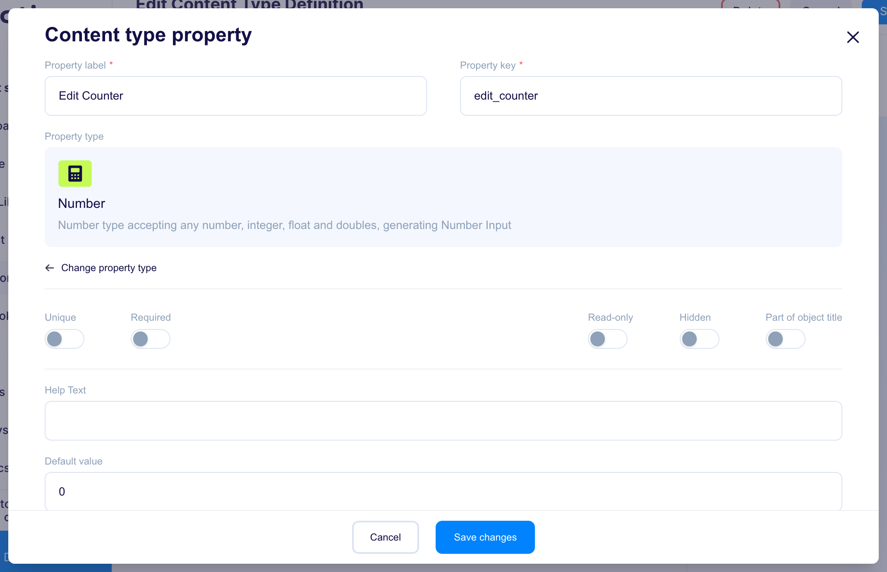
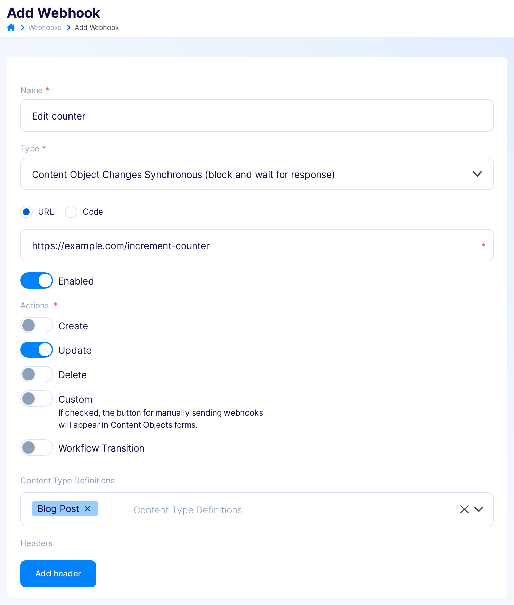

title: Synchronous webhooks examples
description: How to use sync webhooks in Flotiq - examples

# Sync Webhook examples

## Example with payload modification
In this example we will see how to modify one of the fields of a content object in an external system. 
On each update of a `BlogPost` object we will increment the field `edit_counter`.

1. Add the `edit_counter` field to `BlogPost` CTD, set the field type to `number` and default value to 0.
  {: .center .border}
  
2. Let's take the following simple app as an example of an external system:  
  ```js
  const express = require('express')
  const app = express();
  app.use(express.json());

  const port = 8000;

  app.post('/increment-edit-counter', (req, res) => {
    const payload = req.body.payload;
    payload.edit_counter + 1;  
    const response = {
      type: "response",
      subject: "content-object",
      event: "pre-create",
      response: {},
      payload: {payload}
    };

    res.send(response);
  })
  ```
  
3. Add a [webhook](https://editor.flotiq.com/webhooks/edit):
    - give it a name (e.g. Edit counter)
    - set the type to `Synchronous (block and wait for response)`
    - provide the URL where your processing app is available
    - check the `Enabled` field
    - select the `Update` action to trigger the webhook
    - pick the `BlogPost` Content Type Definition as a source for thie webhook.
  {: .center .border}
4. Once the webhook is added - each update on a `BlogPost` object will call the service above and the `edit_counter` field will be incremented!
  

