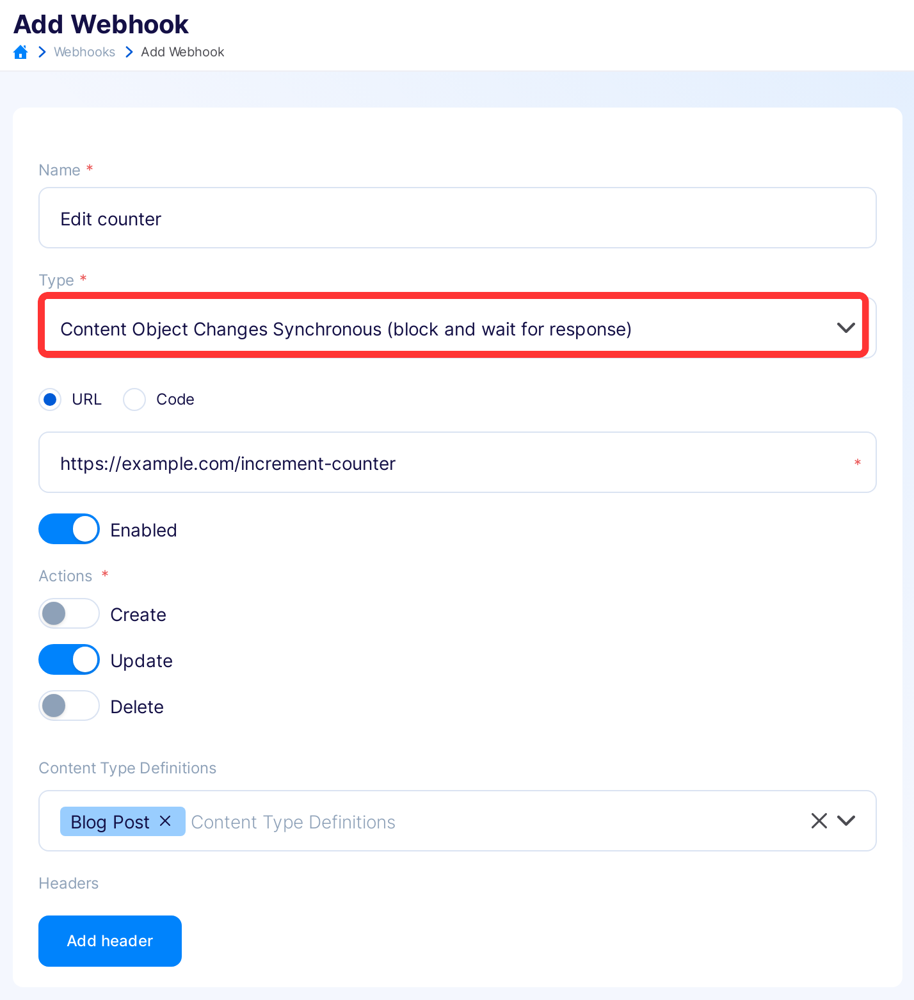

title: Synchronous webhooks
description: How to use synchronous webhooks in Flotiq

# Synchronous webhooks

## What is a synchronous webhook?

Sync webhooks are executed in-band during Flotiq request processing on the following events:

- PRE-CREATE - before persisting new content objects
- PRE-UPDATE - before updating existing objects
- PRE-DELETE - before deleting existing objects.

When a sync webhook is registered - the Flotiq backend will call out to an external service when you make an API call that would normally trigger a create, update or delete operation on your content. This external service can do one of 2 things:

- modify the payload that was originally sent to Flotiq and pass it for further processing,
- stop the request from processing further.

We will call these 2 types of webhooks *mutating webhooks* and *validating webhooks* (after the [admission controller webhooks](https://kubernetes.io/docs/reference/access-authn-authz/admission-controllers/) in K8s which inspired this feature).

!!! Tip
    From a setup perspective both mutating and validating webhooks are handled exactly the same way. The only difference is in the response they return and the effect it has on further processing of the payload.

## Sync webhook payload

All sync webhooks generate a payload according to the following schema:

```
{
    "type":"request",
    "subject":"content-object",
    "event": "pre-create",
    "sequenceNumber": 0,
    "contentTypeName" : "ContentTypeName",
    "userInfo": {
        "id": "user's ID",
        "firstName": "user's first name",
        "lastName": "user's last name",
        "apiKeyName": "name of the API key that triggered webhook (if there is one)"
    },
    "payload": {
        ... <-- this is the object that was originally sent to Flotiq
    }
}
```
Flotiq backend will make sure to send this payload to the system you registered as the sync webhook target.
{ data-search-exclude }

## Mutating webhooks

There are many cases when the ability to modify data being received by Flotiq comes in handy, for example:

- generating slugs for web pages
- calculating field values based on other fields
- populating object's fields with data from external sources

it can now be easily done through a mutating webhook. Once the processing system receives the standard webhook payload from Flotiq - it can freely the object contents (as long as it conforms with the object's Content Type Definition). Once the object is processed - the system responds with a HTTP 200 code and a JSON object of the following form:

```
HTTP 200:
{
    "type":"response",
    "subject":"content-object",
    "event": "pre-create",
    "sequenceNumber": 0,
    "response": {}, // response field is used to provide the `errors` array in case of issues
    "payload": { // payload field is used to return the object that will be passed to next webhook
        ... <-- this is the modified object
    }
}
```
{ data-search-exclude }

## Validating webhooks

The second use case for sync webhooks is external validation. In a similar way as with the mutating webhook - an external system receives payload from Flotiq. Once the system processes the object it can respond in 2 ways:

- with an `HTTP 200` response, without making changes to the object - this will result in processing the payload further in Flotiq,
- with an `HTTP 400` response, raising validation errors - this will stop processing in Flotiq.

Example of a passed validation:

```
HTTP 200:
{
    "type":"response",
    "subject":"content-object",
    "event": "pre-create",
    "sequenceNumber": 0,
    "response": {}, // response field is used to provide the `errors` array in case of issues
    "payload": { // payload field is used to return the object that will be passed to next webhook
        ...
    }
}
```
{ data-search-exclude }

and in case of failed validation:

```
HTTP 400:
{
    "type":"response",
    "subject":"content-object",
    "event": "pre-create",
    "sequenceNumber": 0,
    "response": {
      errors: []
    },
    "payload": {
        ...
    }
}
```
{ data-search-exclude }

!!! Note
    In case you register multiple webhooks for a single CTD - they will be processed sequentially. There is no guarantee on the order of processing. All webhooks have to respond successfully in order for the object to be processed.
    
{: .center .border}

## Setting up sync webhooks

In order to create a sync webhook you can follow the same process as for async ones, just pick the "Synchronous" type. Other options can be selected just as for async.

{: .center .width75 .center .border}

Once this is configured - the payload will be sent to an external system and the sync webhook process will be triggered.

## How errors are handled

In case the remote system fails to respond according to one of the formats described above - Flotiq will stop processing the request and respond with an HTTP `400` error like the following:

```
{
    "__webhook": [
        "Error processing Content Validation Demo webhook: Could not decode JSON, syntax error - malformed JSON."
 
    ]
}
```
{ data-search-exclude }

in such case please check the following:

1. Make sure the remote system is returning a proper `200` or `400` response, as described above.
2. Check the remote system's logs to verify the cause of misbehavior.
